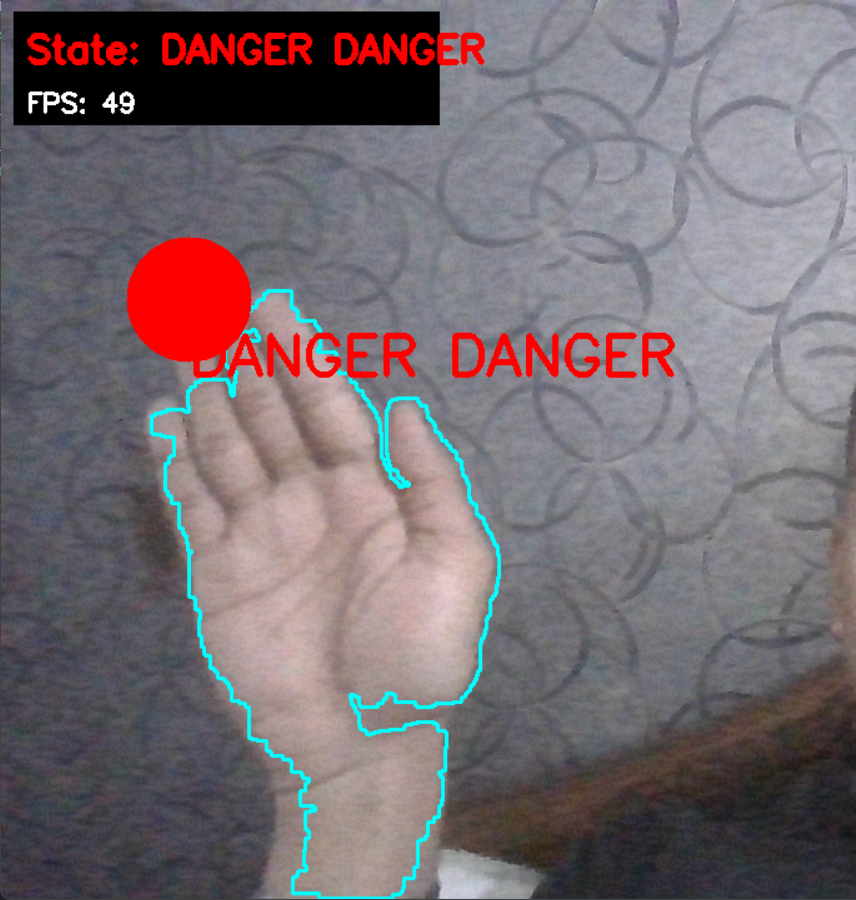
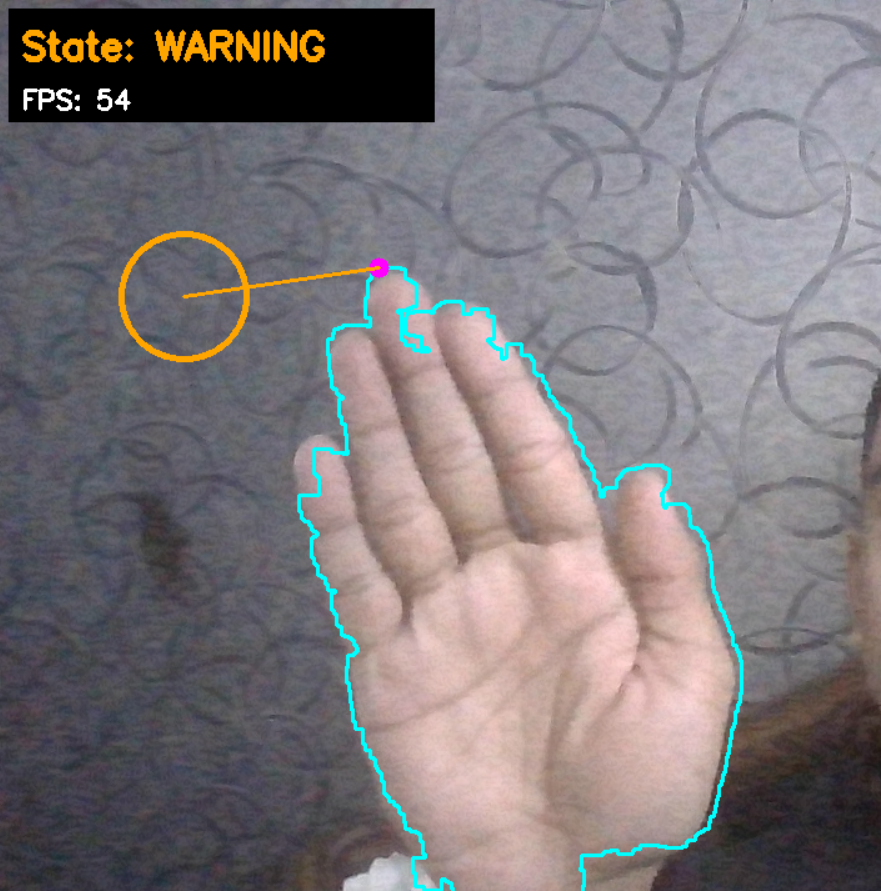
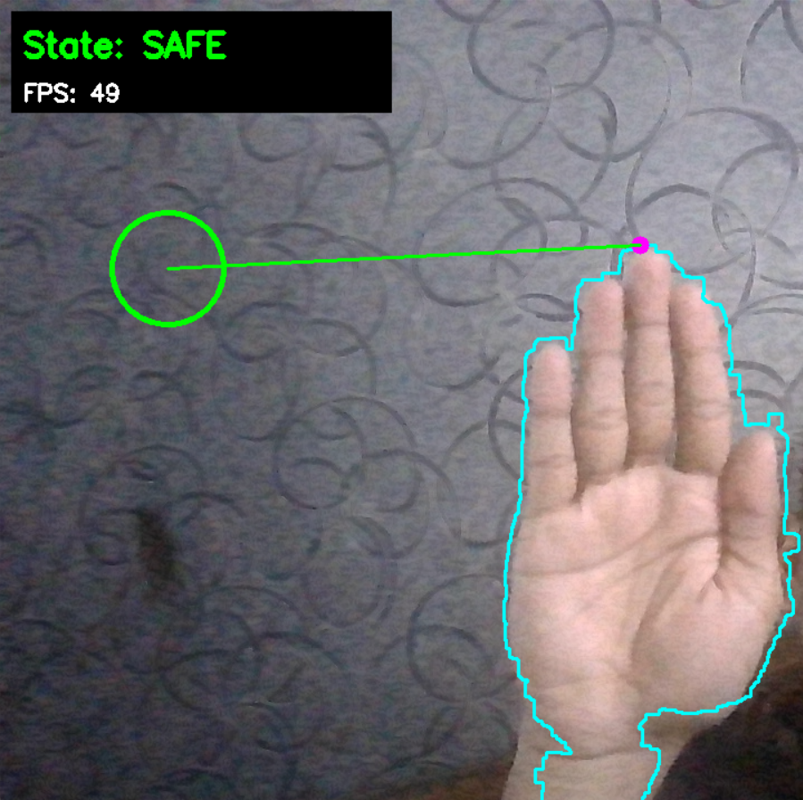

# Hand Safety Monitor

Simple real-time hand safety demo using OpenCV to detect a fingertip and warn when it approaches a virtual object.

Files
- `calibrate_hand.py`: Interactive HSV-based color calibrator. Click on your hand in the camera window to generate `lower_skin` / `upper_skin` HSV arrays printed to the terminal.
- `hand_tracker.py`: Main monitor. Detects the hand contour using HSV skin thresholds, approximates the fingertip and computes distance to a fixed virtual object to show SAFE / WARNING / DANGER states.

Requirements
- Python 3.8+ (Windows, macOS, Linux)
- Packages:
  - `opencv-python`
  - `numpy`

Quick setup (Windows cmd.exe)
```
python -m venv .venv
.venv\Scripts\activate
pip install opencv-python numpy
```

Calibrate (recommended)
1. Run the calibrator to get skin HSV thresholds:
```
python calibrate_hand.py
```
2. Click on your hand in the `Calibration` window. The script prints two lines like:
```
lower_skin = np.array([H_low, S_low, V_low], dtype=np.uint8)
upper_skin = np.array([H_high, S_high, V_high], dtype=np.uint8)
```
3. Copy those two arrays and replace the `lower_skin` / `upper_skin` values inside `hand_tracker.py` (search for those variable definitions near the top of `get_hand_contour`). Save the file.

Run the monitor
```
python hand_tracker.py
```
- Press `q` to quit.

Notes & tips
- If detection is poor, try:
  - Re-running `calibrate_hand.py` under the same lighting conditions and copying the printed ranges.
  - Moving to more uniform lighting (avoid strong backlight or colored lights).
  - Increasing/decreasing the buffers in `calibrate_hand.py` (see `hue_buffer`, `sat_buffer`, `val_buffer`).
- On multi-camera systems you may need to change the camera index in both scripts (pass an index to `cv2.VideoCapture(0)` → `cv2.VideoCapture(1)`, ...).
- `hand_tracker.py` assumes the largest contour with area > 1000 is the hand. Adjust that threshold if you notice false positives.

Troubleshooting
- No camera feed: ensure camera permissions are granted and no other program is using the camera.
- Low FPS: try reducing frame resolution or closing other apps.

## Screenshots

Below are example frames captured from the demo showing the three safety states. The images are stored in `assets/`.

- **State: DANGER** — fingertip is inside the danger radius. The overlay turns red and shows "DANGER".



- **State: WARNING** — fingertip is approaching the object; warning visuals (orange) are shown.



- **State: SAFE** — fingertip is outside the warning radius; visuals are green.



Possible improvements
- Use a more robust hand detector (MediaPipe Hands) for fingertip/keypoint accuracy.
- Replace fixed virtual object with dynamic UI or multiple objects.
- Swap the hard-coded HSV ranges for a small config file and auto-load calibration values.
